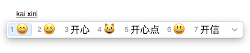

Apple-pinyin-emoticons
======================

Apple's OS X and iOS Chinese pinyin input can be used for emoticon input. This is a mapping showing you how to find the emoticons.

## Usage example
Enter pinyin with a pinyin keyboard(e.g. _Pinyin - Simplified_) and the emoticon will appear as an option.

## Pinyin to emoticon mapping
_This mapping is for iOS 10 and macOS Sierra. Most emoticons can also be found in older versions, but some are not available._

Description     | Emoticon |  Pinyin           | Chinese
--------------- | -------- | ----------------- | -------
Happy           | 😊        | gaoxing           | 高兴
Laughing #1     | 😄        | kaixin            | 开心
Laughing #2     | 😃        | kaixin            | 开心
Laughing #3     | 😆        | kaixin            | 开心
Burst into laughter | 😁    | xixi              | 嘻嘻
Blink           | 😉        | qingsong          | 轻松
Kiss            | 😚        | qinqin            | 亲亲
Blowing a kiss  | 😘        | qinqin            | 亲亲
Heart eyes      | 😍        | xihuan/aini       | 喜欢/爱你
In pain         | 😫        | nanguo            | 难过
Angry           | 😠        | shengqi           | 生气
Indifferent     | 😒        | lengmo            | 冷漠
Surprised       | 😯        | yiwai/o           | 意外/哦
Awkward         | 😅        | ganga             | 尴尬
Sweating        | 😓        | han               | 汗
Tired           | 😪        | pilao             | 疲劳
Gloria          | 😇        | tianshi           | 天使
Cold            | 😷        | ganmao            | 感冒
Injured         | 🤕️        | shoushang         | 受伤
Crying          | 😢        | kuqi              | 哭泣/哭
Crying a lot    | 😭        | daku              | 大哭
Horrified       | 😱        | kongbu            | 恐怖
Thinking        | 😔        | sikao             | 思考
Happy cat       | 😺        | kaixin            | 开心
Kissing cat     | 😽        | qinqin            | 亲亲
Cat laughing hard | 😹      | gandong           | 感动
Angel           | 👼        | tianshi           | 天使
Bride           | 👰        | xinniang          | 新娘
Arms up         | 🙆        | kending           | 肯定
Hand out        | 💁        | kefu              | 客服
Begging for forgiveness | 🙇 | kenqiu           | 恳求
Skull           | 💀        | siwang            | 死亡
Ghost           | 👻        | guihun            | 鬼魂
Demon           | 👹        | mogui             | 魔鬼
Not looking     | 🙈        | kanbujian         | 看不见
Not listening   | 🙉        | tingbudao         | 听不到
Heart           | ❤️        | xin/ai            | 心/爱
Black heart     | 🖤        | heixin            | 黑心
Star            | 🌟        | xing              | 星
Stars           | ✨        | xingxing          | 星星
Poop            | 💩        | dabian            | 大便
Sweethearts     | 💑        | lianren           | 恋人
Couple          | 👫        | qinglv            | 情侣
Friends         | 👬        | pengyou           | 朋友
Sisters         | 👭        | jiemei            | 姐妹
Asian wedding   | 🎎        | hunli             | 婚礼
Avatar          | 👤        | geren             | 个人
Flower #1 / rose | 🌹        | hua               | 花
Flower #2       | 💐        | hua               | 花
Flower #3       | 🌼        | hua               | 花
Flower #4       | 🌺        | hua               | 花
Flower #5       | 🌸        | hua               | 花
Flower #6       | 🌷        | hua               | 花
Club            | ♣️        | meihua            | 梅花
Man             | 👨        | nanren            | 男人
Young man       | 👱        | nianqingren       | 年轻人
Boy             | 👦        | nanhai/erzi       | 男孩/儿子
Old man         | 👴        | laonian           | 老年
Woman           | 👩        | nvren             | 女人
Girl            | 👧        | nvhai/nver        | 女孩/女儿
Baby            | 👶        | baobao            | 宝宝
Grandma         | 👵        | nainai            | 奶奶
Police man      | 👮        | jingcha           | 警察
Worker          | 👷        | gongren           | 工人
Princess        | 👸        | gongzhu           | 公主
Santa Claus     | 🎅        | shengdanlaoren    | 圣诞老人
Guard           | 💂        | weishi            | 卫士
Chinese hat     | 👲        | guapimao          | 瓜皮帽
Snow man #1     | ⛄️        | xueren            | 雪人
Snow man #2     | ☃️        | xueren            | 雪人
Robot           | 🤖️        | jiqiren           | 机器人
Alien           | 👽        | waixingren        | 外星人
Money bag       | 💰        | qian              | 钱
Flying money    | 💸        | pochan            | 破产
Tool            | 🔧        | gongju            | 工具
Mobile phone    | 📱        | shouji            | 手机
Glasses         | 👓        | yanjing           | 眼镜
Door            | 🚪        | men               | 门
Moon            | 🌛        | yueliang          | 月亮
Sun             | 🌞        | taiyang           | 太阳
Rainbow         | 🌈        | hong              | 虹
Grapes          | 🍇        | putao             | 葡萄
Red apple       | 🍎        | pingguo           | 苹果
Green apple     | 🍏        | pingguo           | 苹果
Banana          | 🍌        | xiangjiao         | 香蕉
Watermelon      | 🍉        | xigua             | 西瓜
Strawberry      | 🍓        | caomei            | 草莓
Pumpkin         | 🎃        | nangua            | 南瓜
Potato          | 🥔        | tudou             | 土豆
Cucumber        | 🥒        | huanggua          | 黄瓜
Bee             | 🐝        | mifeng            | 蜜蜂
Fish            | 🐟        | yu                | 鱼
Fish #2         | 🐠        | yu                | 鱼
Dolphin         | 🐬        | haitun            | 海豚
Whale           | 🐳        | jingyu            | 鲸鱼
Whale #2        | 🐋        | jingyu            | 鲸鱼
Penguin         | 🐧        | qi'e              | 企鹅
Sheep           | 🐑        | yang              | 羊
Ox              | 🐂        | niu               | 牛
Cow             | 🐮        | muniu             | 母牛
Rabbit          | 🐰        | tuzi              | 兔子
Dog             | 🐶        | gou               | 狗
Cat             | 🐱        | mao               | 猫
Tiger           | 🐯        | hu                | 虎
Lion            | 🦁️        | shizi             | 狮子
Mouse           | 🐭        | laoshu            | 老鼠
Wolf            | 🐺        | lang              | 狼
Bear            | 🐻        | xiong             | 熊
Panda           | 🐼        | xiongmao          | 熊猫
Monkey          | 🐒        | houzi             | 猴子
Snake           | 🐍        | she               | 蛇
Elephant        | 🐘        | daxiang           | 大象
Turtle          | 🐢        | wugui             | 乌龟
Frog            | 🐸        | qingwa            | 青蛙
Dragon          | 🐲        | long              | 龙
Bird            | 🐦        | niao              | 鸟
Chicken         | 🐤        | xiaoji            | 小鸡
Standing chicken |  🐥      | xiaoji            | 小鸡
Chicken in egg  | 🐣        | xiaoji            | 小鸡
Hen             | 🐔        | muji              | 母鸡
Rooster         | 🐓        | gongji            | 公鸡
Turkey          | 🦃️        | huoji             | 火鸡
Horse           | 🐎        | ma                | 马
Milk cow        | 🐄        | nainiu            | 奶牛
Pig #1          | 🐖        | zhu               | 猪
Pig #2          | 🐗        | zhu               | 猪
Pig face        | 🐷        | zhu               | 猪
Fish            | 🐟        | yu                | 鱼
Sweat           | 💦        | liuhan            | 流汗
Bowl of rice    | 🍚        | mifan             | 米饭
Bowl of noodles | 🍜        | miantiao          | 面条
Soup            | 🍲        | nongtang          | 浓汤
Cook            | 🍳        | pengren           | 烹饪
Take-out food   | 🍱        | kuaican           | 快餐
Cup of tea      | 🍵        | cha               | 茶
Bread           | 🍞        | mianbao           | 面包
Domut           | 🍩        | mianbaoquan       | 面包圈
Hamburger       | 🍔        | hanbao            | 汉堡
French fries    | 🍟        | shutiao           | 薯条
Pizza           | 🍕        | pisa              | 披萨
Candy           | 🍬        | tangguo           | 糖果
Lollipop        | 🍭        | bangbangtang      | 棒棒糖
Chocolate bar   | 🍫        | qiaokeli          | 巧克力
Beer            | 🍺        | pijiu             | 啤酒
Beer toast      | 🍻        | pijiu             | 啤酒
Red wine        | 🍷        | hongjiu           | 红酒
Milk            | 🥛        | niunai            | 牛奶
Coffee          | ☕️        | kafei             | 咖啡
Tea             | 🍵        | cha               | 茶
Juice           | 🍹        | guozhi            | 果汁
Boat            | 🚢        | chuan             | 船
Small boat      | 🚣        | xiaochuan         | 小船
Earth #1        | 🌍        | diqiu             | 地球
Earth #2        | 🌏        | diqiu             | 地球
Plane           | ✈️        | feiji             | 飞机
Holiday         | ⛱️        | dujia             | 度假
Car #1          | 🚗        | che               | 车
Car #2          | 🚘        | che               | 车
Bus #1          | 🚌        | gongche           | 公车
Bus #2          | 🚍        | gongche           | 公车
Bus #3          | 🚐        | gongche           | 公车
Bus #4          | 🚎        | gongche           | 公车
Taxi            | 🚕        | chuzuche          | 出租车
Police car      | 🚔        | baojing           | 报警
Passenger boat  | 🛳️        | kechuan           | 客船
Bicycle         | 🚲        | zixingche         | 自行车
Train           | 🚄        | huoche            | 火车
Cargo truck     | 🚚        | huoche            | 货车
Metro train     | 🚇        | ditie             | 地铁
Cable car       | 🚠        | lanche            | 缆车
Rocket          | 🚀        | huojian           | 火箭
Refuel          | ⛽️        | jiayou            | 加油
Hole            | 🕳️        | dong              | 洞
Link            | 🔗        | lianjie           | 链接
Seat            | 💺        | zuowei            | 座位
Toilet seat     | 🚽        | cesuo             | 厕所
Bathtub         | 🛀        | xizao             | 洗澡
Shower          | 🚿        | xizao             | 洗澡
Calendar        | 📅        | riqi              | 日期
Book            | 📖        | chaxun            | 查询
Books           | 📚        | shuji             | 书籍
Bookmark        | 🔖        | shuqian           | 书签
Pen             | ✏️        | xiezuo            | 写作
Note            | 📝        | jilu              | 记录
Ticket          | 🎫        | piao              | 票
Headphones      | 🎧        | erji              | 耳机
TV              | 📺        | dianshi           | 电视
Computer        | 💻        | diannao           | 电脑
Smartphone      | 📱        | shouji            | 手机
Alarm clock     | ⏰        | naozhong          | 闹钟
Shirt           | 👕        | chenshan          | 衬衫
Bed             | 🛏️        | chuang            | 床
Piano keys      | 🎹        | gangqin           | 钢琴
Guitar          | 🎸        | jita              | 吉他
Drum            | 🥁        | gu                | 鼓
Violin          | 🎻        | xiaotiqin         | 小提琴
Trophy          | 🏆        | guanjun           | 冠军
Game pad        | 🎮        | youxi             | 游戏
Joystick        | 🕹️        | caozonggan        | 操纵杆
Mahjong         | 🀄️        | mahjong           | 麻将
Battery         | 🔋        | dianchi           | 电池
Label           | 🏷️        | biaoqian          | 标签
Injection       | 💉        | dazhen            | 打针
Light bulb      | 💡        | dengpao           | 灯泡
Lantern         | 🏮        | denglong          | 灯笼
Crystal ball    | 🔮        | shuijingqiu       | 水晶球
Movie recording | 🎬        | paishe            | 拍摄
Thermometer     | 🌡️        | wenduji           | 温度计
Kimono          | 👘        | hefu              | 和服
High heel shoe  | 👠        | nvxie             | 女鞋
Leather shoe    | 👞        | nanxie            | 难写
White shoe      | 👟        | xie               | 鞋
Sandals         | 👡        | liangxie          | 凉鞋
Hat             | 🎩        | maozi             | 帽子
Running         | 🏃        | paobu             | 跑步
Cycling         | 🚴        | shandiche         | 山地车
Man swimming    | 🏊        | youyong           | 游泳
Woman swimming  | 🏊‍♀️        | youyong           | 游泳
Dancing         | 💃        | tiaowu            | 跳舞
Man dancing     | 🕺        | tiaowu            | 跳舞
Snowboarding    | 🏂        | huaxueban         | 滑雪板
Playing basketball | ⛹️     | dalanqiu          | 打篮球
Ping pong pad   | 🏓️        | pingpangqiu       | 乒乓球
Tennis ball     | 🎾        | wangqiu           | 网球
Basketball      | 🏀        | lanqiu            | 篮球
Football        | ⚽️        | zuqiu             | 足球
Volleyball      | 🏐️        | paiqiu            | 排球
Billiard ball   | 🎱        | zhuoqiu           | 桌球
Badminton racket | 🏸️       | yumaoqiu          | 羽毛球
Fire            | 🔥        | huo               | 火
Bomb            | 💣        | hong              | 轰
House #1        | 🏠        | jia/fangzi        | 家/房子
House #2        | 🏡        | jia               | 家
Church          | ⛪️        | jiaotang          | 教堂
Church wedding  | 💒        | hunli             | 婚礼
Shrine          | ⛩️        | shenshe           | 神社
Tree #1         | 🌳        | shu               | 树
Tree #2         | 🌲        | shu               | 树
Tree #3         | 🌴        | shu               | 树
Christmas tree  | 🎄        | shengdanshu       | 圣诞树
Recycle         | ♻️        | huanbao           | 环保
Clothes         | 👔        | yifu              | 衣服
Work            | 💼        | shangban          | 上班
School bag      | 🎒        | shangxue          | 上学
Peace sign      | ✌️        | ye                | 叶
OK              | 👌        | hao               | 好
Fist bump       | 👊        | quantou           | 拳头
Thumbs up       | 👍        | zan               | 赞
Thumbs down     | 👎        | buhao             | 不好
Writing         | ✍️        | xiezi             | 写字
Waving hand     | 👋        | shou/zaijian      | 手/再见
Clapping hands  | 👏        | huanying          | 欢迎
Muscle          | 💪        | jirou             | 肌肉
Hear/Ear        | 👂        | ting/erduo        | 听/耳朵
Look/Eyes       | 👀        | kan/yanjing       | 看/眼睛
Speak           | 👄        | shuohua           | 说话
Tongue          | 👅        | shetou            | 舌头
Statue of liberty | 🗽      | ziyounvshen       | 自由女神
Thought bubble  | 💭        | kaolv             | 考虑
Cloud           | ☁️        | yun               | 云
Rain #1         | 🌧️        | xiayu             | 下雨
Rain #2         | ☔️        | xiayu             | 下雨
Typhoon         | 🌀        | taifeng           | 台风
Heat            | ♨️        | wenquan           | 温泉
Snowy mountain  | 🏔️        | xueshan           | 雪山
Tent            | ⛺️        | zhangpeng         | 帐篷
US Dollar #1    | 💲        | meiyuan           | 美元
US Dollar #2    | 💵        | meiyuan           | 美元
Japanese Yen    | 💴        | riyuan            | 日元
Euro            | 💶        | ouyuan            | 欧元
Chart           | 📈        | zhang             | 涨
Zzz             | 💤        | shushui           | 熟睡
Warning         | ⚠️        | zhuyi             | 注意
Cross           | ❌        | cuowu             | 错误
On              | 🔛        | kaiqi             | 开启
Plus            | ➕        | jia               | 加
Minus           | ➖        | jian              | 减
Verify          | ✅        | queding           | 确定
Verify #2       | ☑️        | queding           | 确定
Versus          | 🆚        | bi                | 比
New             | 🆕        | xin               | 新
Physics         | ⚛️        | wuli              | 物理
Man             | 🚹        | nanshi            | 男士
Woman           | 🚺        | nvshi             | 女士
Toilet sign     | 🚾        | cesuo             | 厕所
ID              | 🆔        | shenfen           | 身份
Trash bin       | 🚮        | lajitong          | 垃圾桶
OK              | 🆗        | hao               | 好
Free            | 🆓        | mianfei           | 免费
Up!             | 🆙        | ding              | 顶
Upload          | ⏫        | shangchuan        | 上传
Download        | ⏬        | xiazai            | 下载
Up              | ⬆️        | shang             | 上
Down            | ⬇️        | xia               | 下
Left            | ⬅️        | zuo               | 左
Numbers         | 🔢        | shuzi             | 数字
Right           | ➡️        | you               | 右
Zero            | 0⃣️        | ling              | 零
One             | 1⃣️        | yi                | 一
Two             | 2⃣️        | er                | 二
Three           | 3⃣️        | san               | 三
Four            | 4⃣️        | si                | 四
Five            | 5⃣️        | wu                | 五
Six             | 6⃣️        | liu               | 六
Seven           | 7⃣️        | qi                | 七
Eight           | 8⃣️        | ba                | 八
Nine            | 9⃣️        | jiu               | 九
Ten             | 🔟        | shi               | 十
1 o'clock       | 🕐        | yidian            | 一点
2 o'clock       | 🕑        | liangdian         | 两点
3 o'clock       | 🕒        | sandian           | 三点
4 o'clock       | 🕓        | sidian            | 四点
5 o'clock       | 🕔        | wudian            | 五点
6 o'clock       | 🕕        | liudian           | 六点
7 o'clock       | 🕖        | qidian            | 七点
8 o'clock       | 🕗        | badian            | 八点
9 o'clock       | 🕘        | jiudian           | 九点
10 o'clock      | 🕙        | shidian           | 十点
11 o'clock      | 🕚        | shiyidian         | 十一点
12 o'clock      | 🕛        | shierdian         | 十二点
